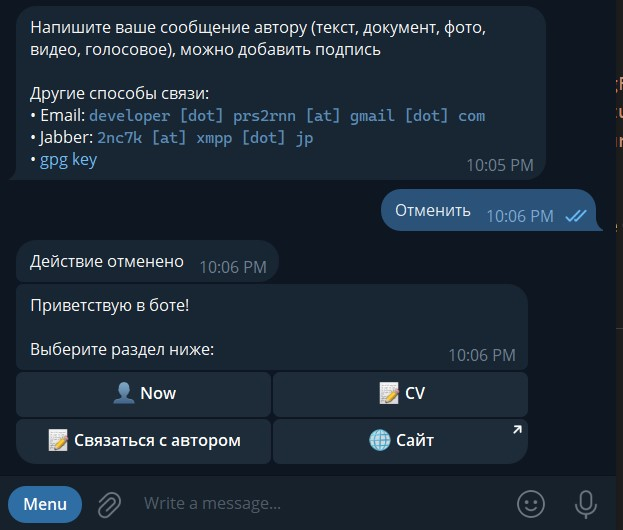

# MyCardBot

Telegram bot that acts as a personal portfolio and contact hub.
Users can explore skills, resume, blog content, and contact information directly inside Telegram.

## Preview

## Features

- Personal portfolio inside Telegram
- Skills & experience showcase
- Blog / updates system (changelog-ready)
- Direct contact interface
- Fast async performance
- Lightweight SQLite storage

## Tech Stack

- **Language**: Python 3.14
- **Framework**: [Aiogram 3.x](https://docs.aiogram.dev/) — modern async Telegram bot framework
- **Database**: SQLite via [aiosqlite](https://pypi.org/project/aiosqlite/)
- **Dependency Management**: Poetry
- **Configuration**: Environment variables (`.env`)
- **Logging**: Built-in Python `logging`

## CI/CD

This project is extended with:

- GitHub Actions
- Semantic versioning (python-semantic-release)
- Docker containerization
- Automatic releases

## Contributing

Contributions are welcome!

You can help by:

- Reporting bugs
- Suggesting features
- Improving architecture
- Writing tests

## License

This project is licensed under the MIT License.
