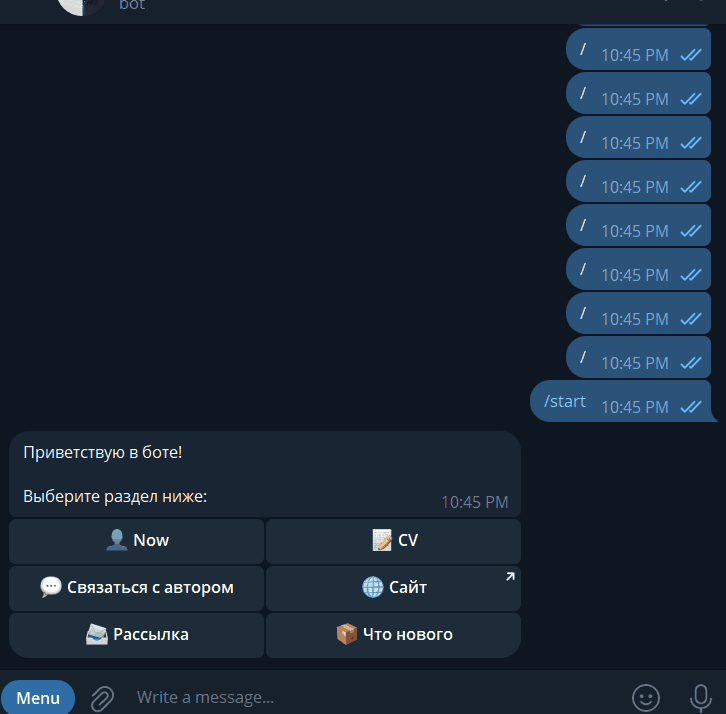

# MyCardBot


[](
https://github.com/prs2rnn/mycardbot/actions
)


Telegram bot that acts as a personal portfolio and contact hub.
Users can explore skills, resume, blog content, and contact information directly inside Telegram.

## Preview



## Features

- Personal portfolio inside Telegram
- Skills & experience showcase
- Blog / updates system (changelog-ready)
- Direct contact interface
- Fast async performance
- Lightweight SQLite storage

## Installation

1. Clone repository

```bash
git clone https://github.com/prs2rnn/mycardbot.git
cd mycardbot
```

2. Install dependencies

```bash
poetry install
```

3. Setup environment

- Create .env file
- Create private channel and add the bot to it as admin

4. Run bot

```bash
poetry run python src/mycardbot/main.py
```

## Tech Stack

- **Language**: Python 3.14
- **Framework**: [Aiogram 3.x](https://docs.aiogram.dev/) — modern async Telegram bot framework
- **Database**: SQLite via [aiosqlite](https://pypi.org/project/aiosqlite/)
- **Dependency Management**: Poetry
- **Configuration**: Environment variables (`.env`)
- **Logging**: Built-in Python `logging`

## CI/CD

This project is extended with:

- GitHub Actions
- Semantic versioning (python-semantic-release)
- Docker containerization
- Automatic releases

## Architecture Notes

- Fully asynchronous (async/await)
- Database layer separated from bot logic
- Designed for easy scaling (can migrate to PostgreSQL later)
- Clean separation of handlers and services

## Database

The bot uses SQLite and automatically creates tables on first launch.

No manual setup required.

## Development

Run tests:

```bash
pytest
```

## Live Demo

[](https://t.me/Prs2rnnBot)

## Contributing

Contributions are welcome!

You can help by:

- Reporting bugs
- Suggesting features
- Improving architecture
- Writing tests

## License

This project is licensed under the MIT License.
